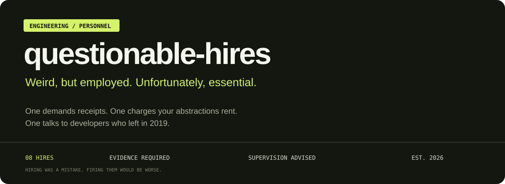
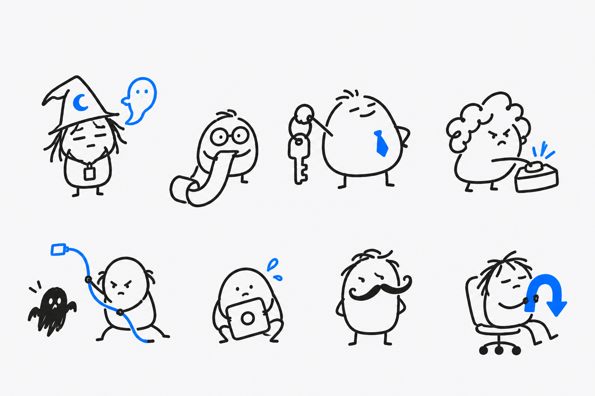
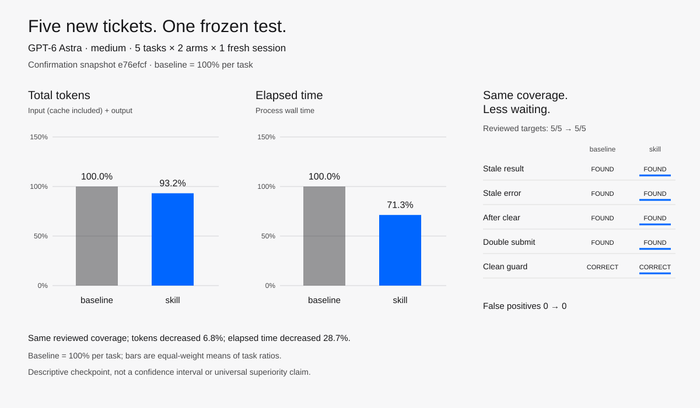

<p align="center"></p>

<p align="center"></p>

# Questionable Hires

**이걸 뽑네. 근데 일을 하네.**

레거시 코드의 이유를 추적하고, 수정을 검증하고, 허술한 테스트와 배포 계획을
점검하는 개발자 스킬 8개입니다. 각자 맡는 일과 종료 조건이 분명합니다.
GPT-6 Astra를 염두에 두고, 다른 도구에도 전달할 수 있는 스킬 파일로 만들었습니다.

**개발 프리뷰입니다. 팀 전체의 품질·비용 개선은 아직 입증되지 않았습니다.**
[웹사이트](https://hires.no-money-do-you-have-money.com/ko/) · [English](README.md) ·
[역할 선택](docs/CHOOSE-A-HIRE.ko.md) · [모델 사용량 없이 데모 실행](docs/SHARE.md#a-real-demo-without-model-usage)

## 이런 일을 시킵니다

| 한국어 별칭 · 코드명 | 한마디 | 맡기는 일 |
| --- | --- | --- |
| 레거시 고고학자 · `necromancer` | 전임자는 퇴사했다. 이유는 Git에 남았다. | 현재 호출부와 Git 이력으로 이상한 코드의 이유 추적 |
| 수정 검증관 · `receipt` | 고쳤다고? 전후 증거부터. | 수정 전 실패와 수정 후 통과를 실제 실행으로 확인 |
| 구조 관리인 · `landlord` | 이 추상화 유지비는 누가 냄? | 구조의 실제 소비자와 유지 비용 검토 |
| 클릭 꼬투리 QA · `mother-in-law` | 저장 누르고 또 누르면? | 중복 동작·응답 순서·빈 결과 같은 사용자 흐름 검증 |
| 가설 퇴마사 · `exorcist` | 캐시 탓이라는 귀신부터 잡자. | 추측을 구분 가능한 실험으로 바꾸는 원인 분석 |
| 범위 협상가 · `hostage-negotiator` | 버튼 하나만 고치기로 했잖아요. | 작은 요청이 불필요한 리팩터링으로 커지는 것 방지 |
| 테스트 사기 감별사 · `con-artist` | 테스트가 mock한테 속고 있습니다. | 실제 동작을 망가뜨려도 통과하는 테스트 확인 |
| 배포 생존 담당 · `friday` | 월요일의 내가 복구할 수 있음? | 배포 중 버전 호환성과 롤백 가능성 검토 |

<a id="설치"></a>

## 한 명 채용하기

Node.js/npm과 Git이 있다면 스킬과 지원 에이전트를 선택할 수 있습니다.

```sh
npx skills add SoonGwan/questionable-hires
```

질문 없이 현재 프로젝트의 Codex에 한 명만 복사하려면:

```sh
npx skills add SoonGwan/questionable-hires --agent codex --skill mother-in-law --copy -y
```

독립적인 [skills CLI](https://github.com/vercel-labs/skills)를 사용하는 명령입니다.
[설치·업데이트·제거와 저장소의 Python 설치기](docs/INSTALL.md) ·
[오프라인 전달용 독립 아카이브](docs/STANDALONE-ARCHIVE.md#한국어) ·
[날짜가 명시된 공개 설치 검증](docs/PUBLIC-LAUNCH.md).

Codex CLI나 IDE의 새 대화에서:

```text
$necromancer 이 호환성 분기 지워도 됨?
$receipt 이 수정으로 진짜 중복 저장이 막히는지 확인해줘.
$friday 이 배포 롤백 가능한지 봐줘.
```

<a id="도구도-들고-출근합니다"></a>

자동 선택을 지원하지만, 8개를 설치한다고 매 작업에 전부 투입하지는 않습니다.
기존 프로젝트 테스트가 우선이며 [보조 도구와 적용 범위](docs/HELPERS.ko.md)는
필요할 때 확인하세요. 상시 실행 훅·백그라운드 서비스·텔레메트리·모델 설정 변경은 없습니다.

## 진짜 작동하나요?

**integration07 — 2026-09-28, 측정 자원 `1be35120`: 합계 토큰 +1.67%,
실행 시간 −9.63%, 두 비용 동시 감소는 2/8입니다.** 한정된 과제 결과는 유지됐지만
품질 우위는 입증되지 않았습니다. 이미 노출된 개발 과제이고 조건별 한 번씩 실행했으며,
공유 실행 환경과 검사량 차이가 있습니다.
[전체 비용](benchmarks/ALL-EIGHT-CURRENT-07-COSTS.md) ·
[원본 검토와 한계](benchmarks/ALL-EIGHT-CURRENT-07-REVIEW.md) ·
[현재 판단 목록](benchmarks/CURRENT-CANDIDATE-STATUS.md).

아래 사전 고정 확인 실험은 한 역할을 별도 과제에서 측정한 결과입니다.

<!-- featured-benchmark:start -->

**최신 사전 고정 확인 실험:** 클릭 꼬투리 QA(`mother-in-law`)는 검토 대상 **5/5**, 스킬 미적용 조건은 **5/5**를 충족했고 스킬 오탐은 **0건**이었습니다. 실행 전에 커밋한 새 과제 5개에서 스킬의 정규화 총 토큰은 **93.2%**, 실행 시간은 **71.3%**였습니다. 과제·조건별 새 세션 1회 결과이며 팀 전체나 반복 표본의 우월성을 뜻하지 않습니다.

<picture>
  <source media="(prefers-color-scheme: dark)" srcset="benchmarks/results/mother-in-law-confirmation-2026-09-12/comparison-dark.svg">
  
</picture>

[과제·원시 수치·방법·한계 확인](benchmarks/results/mother-in-law-confirmation-2026-09-12/README.md)

<!-- featured-benchmark:end -->

[과거 integration06](benchmarks/ALL-EIGHT-CURRENT-06-REVIEW.md)과
[이전 팀 비교·불리한 결과·도구별 실험](docs/ONBOARDING-HISTORY-2026-09-28.ko.md)을
그대로 보존했습니다. 로컬 테스트·공개 배포 확인·모델 측정은 서로 다른 근거이며,
유리한 한 사례가 팀 전체의 비용 절감을 증명하지는 않습니다.

## 실제로 하는 일

테스트 사기 감별사는 `save(...)["ok"]`만 검사하는 테스트가 실제 저장을 제거한
복사본에서도 통과한다는 것을 확인했습니다. 저장된 레코드 자체를 검사하면 결함이
드러납니다. 운영 코드는 건드리지 않았으며, 스킬 없는 기본 모델도 이 문제를 찾았습니다.
[원본 실행 비교와 직접 실행 예제](examples/con-artist.md).

## 같이 채용하기

새 스킬에는 구체적인 일, 실제 예제, 건드리지 않아야 하는 사례가 필요합니다.
[기여 가이드](CONTRIBUTING.md) · [보안 제보](SECURITY.md) · [설계 의도](docs/ASTRA.md) ·
[공개 준비 현황](docs/RELEASE-READINESS.md) · [로드맵](docs/ROADMAP.md) ·
[변경 기록](CHANGELOG.md) · [MIT 라이선스](LICENSE).

캐릭터와 구체적인 개발 습관을 연결하는 방식은
[Ponytail](https://github.com/DietrichGebert/ponytail)에서 영감을 받았습니다.
팀·지침·평가 예제는 이 프로젝트에서 만들었습니다.
