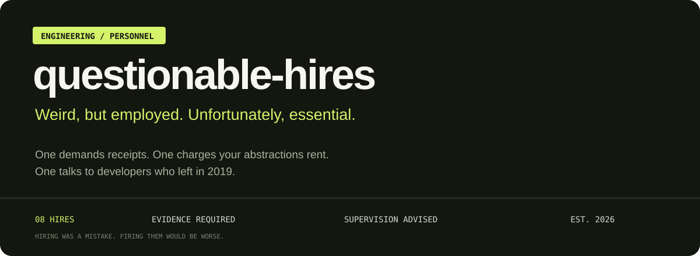
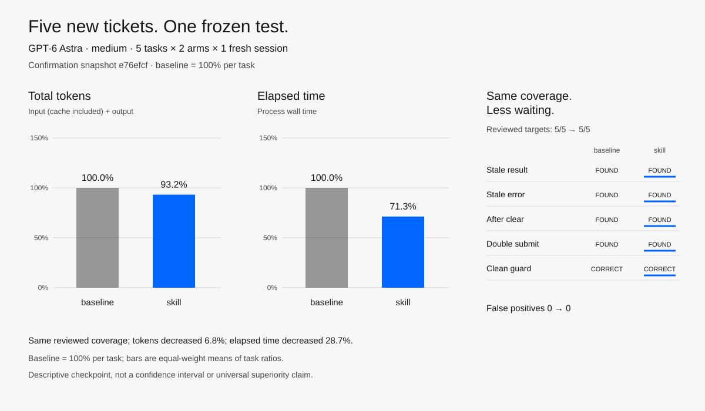
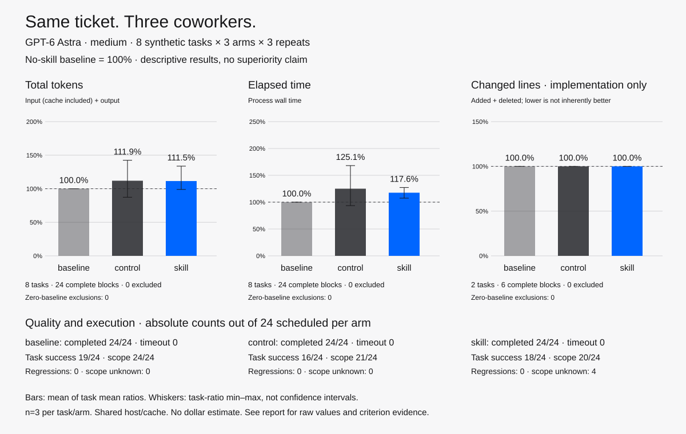

<p align="center"></p>

<p align="center"></p>

<p align="center"><a href="docs/INSTALL.md">Hire the team</a> · <a href="examples/README.md">See them work</a> · <a href="benchmarks/CURRENT-CANDIDATE-STATUS.md">Read the evidence</a> · <a href="README.ko.md">한국어</a></p>

# Questionable Hires

Eight suspiciously effective engineering coworkers for your AI agent.

One demands receipts. One charges your abstractions rent. One talks to developers who left in 2019. Hiring was a mistake. Firing them would be worse.

Each character carries one engineering habit: trace the reason, prove the fix, test the awkward sequence, or keep the release reversible. Built with GPT-6 Astra in mind, using portable skill files.

**Development preview.** All eight hires have been exercised on small synthetic tasks. The baseline usually reached the same central answer. We show actual comparisons and limitations rather than claim a universal improvement.

## The test passed. The record disappeared.

This test looks reassuring:

```python
self.assertTrue(save([], 'record')['ok'])
```

Ask `$con-artist` whether it catches a lost write. In an actual run, it removed the write in a disposable copy:

| Check | Real write | Write removed |
| --- | --- | --- |
| Existing `ok` assertion | Pass | Pass |
| Assertion on stored record | Pass | Fail |

The smallest useful improvement:

```python
store = []
self.assertTrue(save(store, 'record')['ok'])
self.assertEqual(store, ['record'])
```

Production code stayed intact. The no-skill baseline also found this flaw. [Compare all three runs →](examples/con-artist.md)

## Meet the team

| Hire | Unfortunate personality | Useful engineering instinct |
| --- | --- | --- |
| [Necromancer](examples/necromancer.md) | “Their reasons didn't leave with them.” | Trace legacy behavior through callers and history. |
| [Receipt](examples/receipt.md) | “You fixed it? Show me the receipt.” | Verify a fix with a real before/after reproduction. |
| [Landlord](examples/landlord.md) | “Who's paying rent on this abstraction?” | Make abstractions earn their maintenance cost. |
| [Mother-in-law](examples/mother-in-law.md) | “And if I click it twice?” | Reproduce realistic interaction and timing failures. |
| [Exorcist](examples/exorcist.md) | “Let's test your belief in the cache.” | Distinguish debugging hypotheses with experiments. |
| [Hostage Negotiator](examples/hostage-negotiator.md) | “Release the button. The architecture stays.” | Deliver focused changes without optional scope creep. |
| [Con Artist](examples/con-artist.md) | “Your mock is impressed with itself.” | Find tests that let broken behavior pass. |
| [Friday](examples/friday.md) | “Can Monday-you undo this?” | Review version compatibility and recovery paths. |

## Hire one. Or make eight questionable decisions.

With Node.js/npm and Git, install one hire or the whole team:

```sh
npx skills add SoonGwan/questionable-hires
```

The installer discovers all eight hires and lets you select skills and supported
agents. For one project-local Codex skill without prompts:

```sh
npx skills add SoonGwan/questionable-hires --agent codex --skill mother-in-law --copy -y
```

This uses the independent [`skills`](https://github.com/vercel-labs/skills) CLI;
review it and the selected skills before execution. During the private preview,
Git credentials are required. After the repository is public, the same command
works without repository access.

Or use the bundled Python 3.8+ installer directly:

```sh
git clone https://github.com/SoonGwan/questionable-hires.git
cd questionable-hires
python3 scripts/install.py --dest /path/to/your-project/.agents/skills --skill necromancer
```

Replace the project path. Omit `--skill necromancer` to install all eight; add `--dry-run` to preview. Existing skill folders are never overwritten.

Install from a trusted checkout: linked source files or directories are rejected
before writing. On failure or cancellation, the installer attempts to remove
only folders it created. Cleanup can fail too, so inspect any remaining partial
folders before retrying; preserve existing files and personal edits.

In a new Codex CLI or IDE thread:

```text
$necromancer Can we remove this workaround?
$receipt Verify that this fix actually prevents duplicate submissions.
$friday Review this release's rollout and rollback plan.
```

Normal automatic selection is enabled. No lifecycle hooks, telemetry, background services, or model-setting changes. [Installation, updates, and removal →](docs/INSTALL.md)

### Some coworkers brought tools

The installer includes five optional, locally executed helpers. They require **Python 3.9+**; Con Artist, Receipt and Exorcist also require POSIX. They do not install dependencies or run in the background.

- **Con Artist:** disposable Python mutation audits with copied-import checks, separate test/probe exit statuses, bounded log memory and timeouts. [Usage and limits](skills/con-artist/references/python-audit.md). Run trusted tests only: this is not a sandbox.
- **Necromancer:** focused current-line attribution and historical patches, including dirty/shallow-history limits. [Usage and limits](skills/necromancer/references/focused-history.md). It collects evidence; it does not decide whether old behavior is still needed.
- **Friday:** reusable in-memory SQLite reader checks across migration and rollback states. [Usage and limits](skills/friday/references/sqlite-matrix.md). Query success is not production readiness; other database engines require their own evidence.
- **Receipt:** frozen current assertions against two committed Python implementations, with independent outputs and revision IDs. [Usage and limits](skills/receipt/references/existing-fix.md). The [first model check](benchmarks/RECEIPT-HELPER-01.md) is faster but uses more tokens than its preceding sample; no efficiency win is established.
- **Exorcist:** bounded foreground probe execution with independent process deadlines and bounded captured logs. [Usage and limits](skills/exorcist/references/bounded-probe.md). The [first model check](benchmarks/EXORCIST-PROBE-RUNNER-01.md) uses the helper correctly but does not save resources.

Use the normal skill prompts above; the agent can choose the helper when it saves repeated work. A small task or an already-established result may be cheaper to handle directly. Installing the team does not imply every task should use all eight hires.

## Does it actually work?

<!-- featured-benchmark:start -->

**Latest frozen confirmation:** `mother-in-law` met **5/5** reviewed interaction-QA targets versus baseline **5/5**, with **0** skill false positives. Across 5 new cases committed before execution, the skill used **93.2%** normalized total tokens and **71.3%** normalized elapsed time. This is one fresh session per arm and task, not a whole-team or repeated-sample claim.

<picture>
  <source media="(prefers-color-scheme: dark)" srcset="benchmarks/results/mother-in-law-confirmation-2026-09-12/comparison-dark.svg">
  
</picture>

[Inspect the frozen cases, raw values, method, and limitations](benchmarks/results/mother-in-law-confirmation-2026-09-12/README.md).

<!-- featured-benchmark:end -->

The earlier [candidate-development checkpoint](benchmarks/results/mother-in-law-fast-2026-09-12/README.md)
is retained separately.

**Latest combined check: the efficiency goal is not met.** The current
[nine-task gate](benchmarks/BUNDLE-CURRENT-02-REVIEW.md), 18 fresh sessions at
resource snapshot `e02c9bb`, used **10.33% more total tokens and 23.08% more summed
process time** with skills. Eight of nine skill cells used more tokens and eight
took longer. Some verification was stronger, but missing before evidence, a scope
exception, an omitted history criterion and missing QA output remain in the
accounting. This is an exposed single-repeat regression with unequal work, not
proof of universal harm or benefit. These ratios of sums are not directly
comparable to the original chart's equal-task mean ratios.

**The chart below is the original experiment, not a measurement of today's files.** Later candidates have targeted checks, real HTTPX audits/design reviews, and this project's packaging repair recorded in [current candidate status](benchmarks/CURRENT-CANDIDATE-STATUS.md). Results are mixed: local helper gains do not automatically reduce model-session cost, and some comparisons perform unequal verification. Broad performance improvement remains unproven. Historical runs, including [nine-task screen 05](benchmarks/FAST-REGRESSION-05.md), remain available rather than being replaced by a favorable sample.

<details>
<summary>Historical whole-team experiment — 72 sessions on the original skill files</summary>

We completed **72 fresh GPT-6 Astra sessions** at medium reasoning: eight small synthetic tasks × three arms × three repetitions. Baseline = 100%; generic control used **111.9% tokens / 125.1% time**, and the corresponding skill used **111.5% tokens / 117.6% time**. Implementation line churn was identical. Neither arm saved resources in this experiment.

<picture>
  <source media="(prefers-color-scheme: dark)" srcset="benchmarks/results/astra-repeat-2026-09-11/analysis/comparison-dark.svg">
  
</picture>

Strict evidence-and-scope success was **19/24 baseline, 16/24 control, 18/24 skill**. Central fixes and diagnoses generally agreed. Four skill sessions have unresolved rejected-patch records; three control audits changed existing tests. These are unblinded author judgments on tiny synthetic tasks, not proof of superiority or a general safety ranking. No session timed out; no dollar cost is inferred from subscription usage.

[Original repeated experiment, methods and raw evidence](benchmarks/REPORT-2026-09-11.md) · [Reproduce the comparison](benchmarks/README.md) · [Earlier n=1 smoke results](benchmarks/REPORT.md) · [Eight worked examples](examples/README.md)

</details>

Historical whole-team routing checks selected the expected skill files in eight sessions. A historical local bundle also passed CLI installation and removal. See [routing evidence](benchmarks/REPORT.md#automatic-routing-with-the-whole-team) and the dated [installation record](docs/INSTALLATION-TEST.md); these are not checks of every later revision.

Recent evidence, kept separate from the chart:

- [Inspect a recent automatic audit](benchmarks/results/probe-adoption-01/README.md):
  both arms' commands, captured output, answers and usage, including higher token
  cost and no helper adoption. Redactions and missing output are documented.
- [Try a two-fault audit without model usage](examples/con-artist.md#try-the-helper-without-model-usage):
  a runnable helper example, not evidence that the model is faster with the skill.

- [Automatic selection versus no skill](benchmarks/CURRENT-SELECTION-01.md): two appropriate selections, but more tokens in both tasks and mixed elapsed time; actual work differs.
- [Unrelated requests](benchmarks/ROUTING-NEGATIVE-01.md) and [a configured consumer under examples](benchmarks/LANDLORD-CONFIGURED-01.md): narrow routing checks, not general accuracy or efficiency scores.
- [Open a complete previous/candidate comparison](benchmarks/results/landlord-compact-01/README.md): commands, captured outputs, answers and usage you can inspect without private logs. That comparison is adverse too.

These are skill-guided workflows, not guarantees. Actual tool access, model behavior, project complexity, and user instructions determine the outcome. Other hosts and remote marketplace distribution remain unverified.

## Why Astra?

The skills give Astra focused jobs and explicit stopping conditions. User intent takes precedence over the character; routine choices use project context; technical claims need evidence. Humor stays brief. [Design rationale →](docs/ASTRA.md)

## We're unfortunately hiring

A new hire needs a distinct engineering job, a realistic example, and a case where it should leave things alone. Start with [the contribution guide](CONTRIBUTING.md). Use synthetic or public data in reports; see [security reporting](SECURITY.md).

```sh
python3 -m pip install -r requirements-dev.txt
python3 scripts/validate.py
python3 -m unittest discover -s tests -v
```

[Release readiness and remaining gates](docs/RELEASE-READINESS.md) · [Roadmap](docs/ROADMAP.md) · [Changelog](CHANGELOG.md) · [MIT license](LICENSE)

## Inspiration

[Ponytail](https://github.com/DietrichGebert/ponytail) showed how a memorable character can carry a concrete engineering habit. Our team, skill instructions, and evaluation fixtures are original. We also learned from its published benchmark corrections: use a real agent baseline, isolate the arms, and keep the ties.
