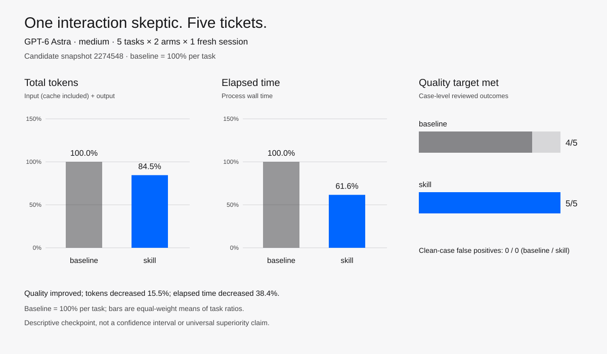

# Mother-in-law fast checkpoint — September 12, 2026

<picture>
  <source media="(prefers-color-scheme: dark)" srcset="comparison-dark.svg">
  
</picture>

This is a candidate-development checkpoint, not a universal superiority claim.
Five preregistered cases were run once per arm with GPT-6 Astra at medium effort.
Four cases exercise deterministic Python interaction state; one uses trusted input
and rendered observations in pinned Linux Chromium. Every cell used a fresh
workspace and session.

| Case | Baseline tokens / seconds | Skill tokens / seconds | Reviewed outcome |
|---|---:|---:|---|
| `search-order` | 97,320 / 43.829 | 65,712 / 24.034 | Both reproduce the stale result |
| `search-protected` | 64,137 / 43.577 | 65,740 / 23.901 | Both correctly report clean; no false positive |
| `search-existing-runner` | 85,485 / 50.378 | 68,304 / 27.350 | Both reproduce the stale result and reuse the runner |
| `nested-search-qa` | 104,500 / 67.220 | 70,621 / 50.555 | Both follow nested scope and reproduce required sequences |
| `browser-catalog` | 123,853 / 145.482 | 129,874 / 100.108 | Baseline finds 2/3 target defects; skill finds 3/3 |

Total tokens are input—including cached input—plus output. The resource bars use
the existing project convention: equal-weight arithmetic mean of each task's
skill/baseline ratio. This yields **84.5% tokens** and **61.6% elapsed time**.
Raw sums are 475,295 versus 400,251 tokens and 350.486 versus 225.948 seconds;
they are retained for transparency but are not substituted into the chart.

Quality target counts are **4/5 baseline** and **5/5 skill**. The difference is
the browser case's older-failure-after-newer-success defect. Both arms correctly
reported the guarded clean case, so false positives are 0/1 for each arm.

Limitations: n=1 per case/arm, mixed host and pinned-container runtimes across
cases, shared account/cache, sequential execution, and author review of behavioral
criteria. Whiskers and confidence intervals are intentionally absent. Local raw
logs remain ignored; this directory contains reviewed aggregate facts, not private
session traces.

`cells.json` contains sanitized per-cell resources and review verdicts. Verify
every plotted value with:

```sh
python3 benchmarks/audit_mother_in_law_checkpoint.py \
  benchmarks/results/mother-in-law-fast-2026-09-12
```

Regenerate the light and dark SVGs:

```sh
python3 benchmarks/render_mother_in_law_chart.py \
  benchmarks/results/mother-in-law-fast-2026-09-12/data.json \
  --light benchmarks/results/mother-in-law-fast-2026-09-12/comparison-light.svg \
  --dark benchmarks/results/mother-in-law-fast-2026-09-12/comparison-dark.svg
```
