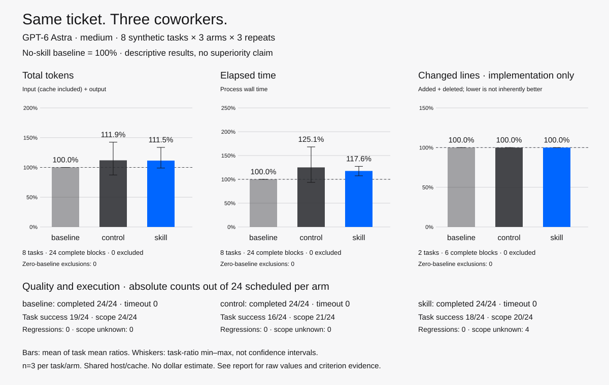

# Historical README evidence — 2026-09-28

Retained from README source `d195a37e` during onboarding reorganization. Everything below is historical evidence at that source, including labels such as “recent”; it is not a maintained latest-result claim. Measured revisions, adverse results and limitations remain attached to their reports. No measurement or chart changed. [한국어](ONBOARDING-HISTORY-2026-09-28.ko.md) · [Current decision index](../benchmarks/CURRENT-CANDIDATE-STATUS.md) · [Helper contracts](HELPERS.md).

## Per-tool development and costs

Con Artist ties new assertions to the required observable contract; object identity
requires an explicit requirement. [Assertion-contract01](../benchmarks/ASSERTION-CONTRACT-01-REVIEW.md)
(2026-09-27, `33530f98`) retains quality but uses **36.43% more summed tokens**
and 12.01% less time than no skill; no joint efficiency gain is established.
The later [native single-module route](../benchmarks/NATIVE-SINGLE-MODULE-ROUTE-02.md)
is locally verified guidance. Its [native-split02 cost checkpoint](../benchmarks/NATIVE-SPLIT-02-COSTS.json)
(2026-09-27, `6c099d68`) uses 43.05% more summed tokens than no skill and
9.35% fewer than its predecessor; the [scoped original review](../benchmarks/NATIVE-SPLIT-02-REVIEW.md)
retains binding-capture, criterion and preservation limits.

Con Artist also accepts [exact test-file edits](../skills/con-artist/references/python-audit-probes.md#improve-existing-tests-at-their-native-paths)
instead of resending a whole file; original/correct/faulty checks stay intact. For large native batch reports,
[inspect captured checks separately](../skills/con-artist/references/native-unittest-batch.md)
to preserve original evidence without rerunning checks.

**Whole-task cost improvement remains unproven.** [Integration07 costs](../benchmarks/ALL-EIGHT-CURRENT-07-COSTS.md) (2026-09-28, `1be35120`): summed tokens +1.67%, CLI elapsed −9.63%; only 2/8 roles decrease both. [Original review](../benchmarks/ALL-EIGHT-CURRENT-07-REVIEW.md) retains unequal checks and recovered output; bounded outcomes are preserved without showing quality superiority. These exposed development tasks are not independent validation. [Historical integration06](../benchmarks/ALL-EIGHT-CURRENT-06-REVIEW.md) remains adverse and accessible.

[Integration05](../benchmarks/ALL-EIGHT-CURRENT-05-COSTS.md)
(2026-09-27, `75183f2f`) used 18.54% more summed tokens and 9.06% more time
across eight exposed development tasks; [scoped original review](../benchmarks/ALL-EIGHT-CURRENT-05-REVIEW.md)
retains scope, criterion and preservation-evidence limitations.
The [interpreter route candidate](../benchmarks/NATIVE-INTERPRETER-ROUTE-01.md)
(2026-09-27, `e918d02d`) avoids failed probe launches in its measured control, but
its six-cell costs are mixed with no joint aggregate token/time saving.
[Current dated evidence and limitations](../benchmarks/CURRENT-CANDIDATE-STATUS.md)
retain adverse development and model-configuration comparisons. The Receipt direct-tool
availability01 pilot (2026-09-27, `b081240e`) is also declined: both models kept
using the CLI and neither task reduced both costs. Supplied-tool routing01
(2026-09-27, `44c4ff5e`) is declined and restored: attempted MCP calls were
blocked by the host approval policy, adding cost before CLI recovery. Model-choice01
(2026-09-27, `6701069f`) is declined; it does not establish joint token/time saving.
Configuration checks remain mixed: [apps01](../benchmarks/ALL-EIGHT-APPS-01-REVIEW.md)
(2026-09-27, `6701069f`) tokens−9.49%/time+0.52%;
[namespaces01](../benchmarks/ALL-EIGHT-NAMESPACES-01-REVIEW.md) (2026-09-27, `0333a084`)
tokens−12.73%/time−2.73%, but only5/8 joint reductions with unequal optional checks.
Neither is adopted or establishes improvement across all eight roles.

[Detailed development history and adverse results](../docs/DEVELOPMENT-NOTES.md)
(snapshot: 2026-09-14, source `17ede49`). Examples include Hostage's higher token
costs and missing original test output, and Friday's acknowledged-writer screen
with +7.01% total tokens. Useful behavior does not imply lower cost or complete
evidence. See [maintained status](../benchmarks/CURRENT-CANDIDATE-STATUS.md) before
interpreting any older result as a claim about current skills.

Use the normal skill prompts above; the agent can choose the helper when it saves repeated work. A small task or an already-established result may be cheaper to handle directly. Installing the team does not imply every task should use all eight hires.

## Earlier team comparisons and routing

The earlier [candidate-development checkpoint](../benchmarks/results/mother-in-law-fast-2026-09-12/README.md)
is retained separately.

**Whole-team checkpoint 08 (2026-09-14): broad efficiency remains unproven.**
The [nine-task review](../benchmarks/BUNDLE-CONTRACT-08-REVIEW.md), 18 fresh sessions
at resource snapshot `ecff8a8`, records **0.58% fewer total tokens and 15.08% less
summed process time** with skills. Three task pairs cost more on both axes; six
use more tokens. Unequal extra work and two original test-output gaps remain
disclosed: protected-search baseline and pending-form skill. Twenty-two separate
native controls match expected outcomes; replay does not fill original gaps.
These exposed authored tasks, n=1 per arm and shared host/cache do not prove a
general 20–30% gain or measure later edits. Ratios of sums differ from the original
chart's equal-task means. [Checkpoint 07](../benchmarks/BUNDLE-CONTRACT-07-REVIEW.md),
[Checkpoint 05](../benchmarks/BUNDLE-CONTRACT-05-REVIEW.md),
[checkpoint 06](../benchmarks/BUNDLE-CONTRACT-06-REVIEW.md) and
[earlier adverse results](../benchmarks/BUNDLE-CURRENT-02-REVIEW.md) remain preserved.

**The chart below is the original experiment, not a measurement of today's files.** Later candidates have targeted checks, real HTTPX audits/design reviews, and this project's packaging repair recorded in [current candidate status](../benchmarks/CURRENT-CANDIDATE-STATUS.md). Results are mixed: local helper gains do not automatically reduce model-session cost, and some comparisons perform unequal verification. Broad performance improvement remains unproven. Historical runs, including [nine-task screen 05](../benchmarks/FAST-REGRESSION-05.md), remain available rather than being replaced by a favorable sample.

Historical whole-team experiment — 72 sessions on the original skill files

We completed **72 fresh GPT-6 Astra sessions** at medium reasoning: eight small synthetic tasks × three arms × three repetitions. Baseline = 100%; generic control used **111.9% tokens / 125.1% time**, and the corresponding skill used **111.5% tokens / 117.6% time**. Implementation line churn was identical. Neither arm saved resources in this experiment.

<picture>
  <source media="(prefers-color-scheme: dark)" srcset="../benchmarks/results/astra-repeat-2026-09-11/analysis/comparison-dark.svg">
  
</picture>

Strict evidence-and-scope success was **19/24 baseline, 16/24 control, 18/24 skill**. Central fixes and diagnoses generally agreed. Four skill sessions have unresolved rejected-patch records; three control audits changed existing tests. These are unblinded author judgments on tiny synthetic tasks, not proof of superiority or a general safety ranking. No session timed out; no dollar cost is inferred from subscription usage.

[Original repeated experiment, methods and raw evidence](../benchmarks/REPORT-2026-09-11.md) · [Reproduce the comparison](../benchmarks/README.md) · [Earlier n=1 smoke results](../benchmarks/REPORT.md) · [Eight worked examples](../examples/README.md)

Historical whole-team routing checks selected the expected skill files in eight sessions. A historical local bundle also passed CLI installation and removal. See [routing evidence](../benchmarks/REPORT.md#automatic-routing-with-the-whole-team) and the dated [installation record](../docs/INSTALLATION-TEST.md); these are not checks of every later revision.

Recent evidence, kept separate from the chart:

- [Inspect a recent automatic audit](../benchmarks/results/probe-adoption-01/README.md):
  both arms' commands, captured output, answers and usage, including higher token
  cost and no helper adoption. Redactions and missing output are documented.
- [Try a two-fault audit without model usage](../examples/con-artist.md#try-the-helper-without-model-usage):
  a runnable helper example, not evidence that the model is faster with the skill.

- [Automatic selection versus no skill](../benchmarks/CURRENT-SELECTION-01.md): two appropriate selections, but more tokens in both tasks and mixed elapsed time; actual work differs.
- [Unrelated requests](../benchmarks/ROUTING-NEGATIVE-01.md) and [a configured consumer under examples](../benchmarks/LANDLORD-CONFIGURED-01.md): narrow routing checks, not general accuracy or efficiency scores.
- [Open a complete previous/candidate comparison](../benchmarks/results/landlord-compact-01/README.md): commands, captured outputs, answers and usage you can inspect without private logs. That comparison is adverse too.

These are skill-guided workflows, not guarantees. Actual tool access, model behavior, project complexity, and user instructions determine the outcome. Other hosts and remote marketplace distribution remain unverified.

